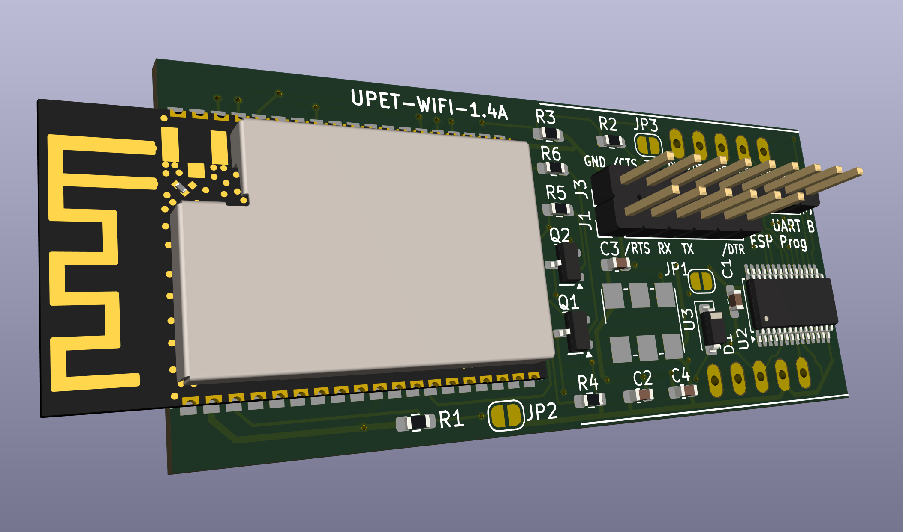

# Wifi breakout module for Micro-PET 3.x, Ultra-CPU 2.x, and Ulti-PET 1.x

This is part of a larger project with multiple boards, with [upet_family](https://github.com/fachat/upet_family) as parent repository.

This module implements a Wifi module for the [Micro-PET](https://github.com/fachat/cbm_micropet), the [Ultra-CPU](https://github.com/fachat/csa_ultracpu), and the [Ulti-PET](https://github.com/fachat/cbm_ultipet). These boards provide an SPI-based breakout connector, which this module plugs in to.

The Wifi-Module used is an ESP32-C3-WROOM-02 module that uses two serial (rs232 on 3.3V TTL level) interfaces - one for firmware updates and logs, the other for the AT commands used to control the communication.
To connect to the main board, this breakout board uses a dual-UART SC16IS752 that has an SPI interface to control it.

## Build

This repository contains the KiCad schematics and PCB layout, as well as gerber files (gerbers directory). and the interactive BOM (bom directory).
Also, in the bom directory is a full XLSX format BOM with manufacturer and Mouser and JLCPCB part numbers, that you can upload to your favourite parts provider.

[Schematics PDF](UPET-Wifi-Schematics.pdf)

